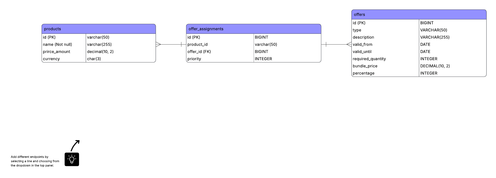
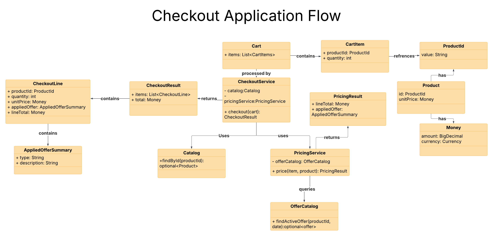
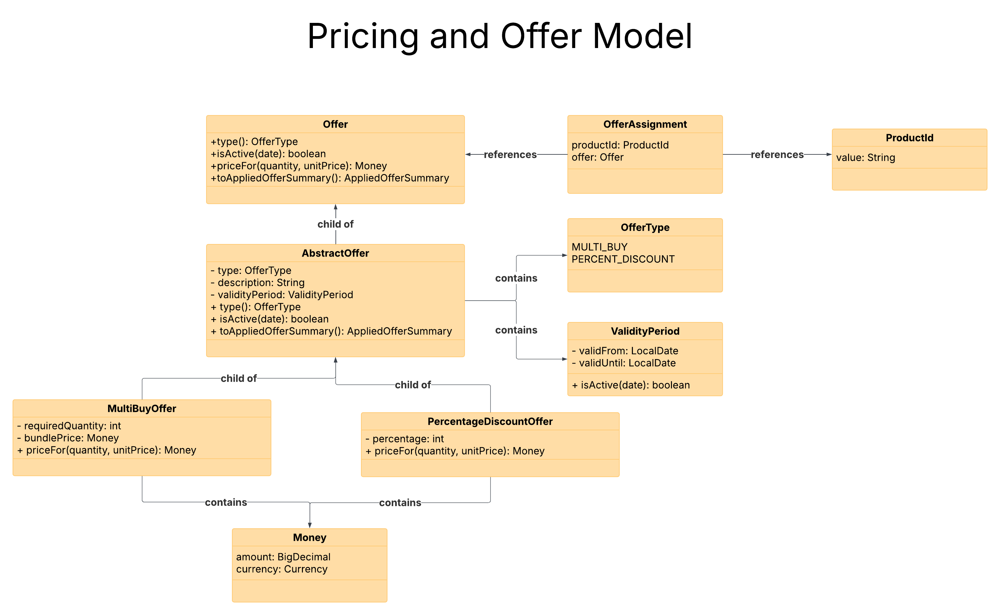

# Checkout Kata

This repository contains a simplified supermarket checkout system implemented as part of a technical exercise.

The goal of the project is to build a maintainable backend service capable of applying promotional offers during checkout.

The implementation is located in the **backend** module.

For detailed documentation about the service, API usage, testing, and architecture decisions see:

[backend/README.md](backend/README.md)

# Architecture Overview

The system design is illustrated through the following diagrams.

## 1. Database Schema (ER Diagram)

The persistence model stores products, promotional offers, and their relationships.

📄 Full resolution: [er-diagram.pdf](docs/er-diagram.pdf)

## 2. Checkout Application Flow

This diagram illustrates how a checkout request flows through the system and how services collaborate to compute the final price.

📄 Full resolution: [checkout-flow.pdf](docs/checkout-flow.pdf)

## 3. Pricing and Offer Model

This diagram shows how pricing rules and promotional offers are represented in the domain layer.

📄 Full resolution: [pricing-flow.pdf](docs/pricing-flow.pdf)
